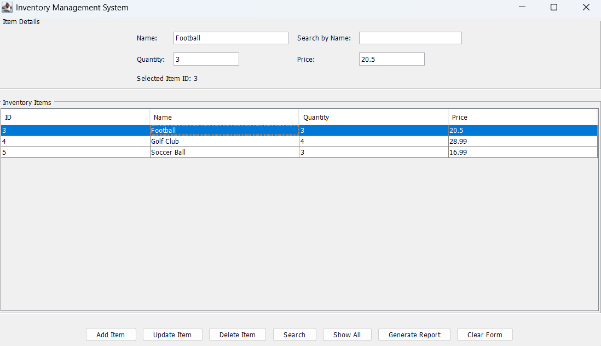
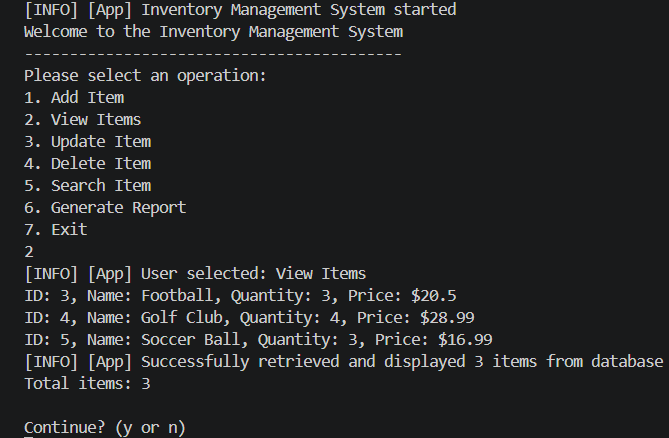

# Inventory Management System

A Java-based inventory management application with both GUI and CLI modes, backed by a MySQL database. The system supports adding, viewing, updating, deleting, and searching inventory items, plus generating a summary report.

## Screenshots

> Add screenshots to a `screenshots/` folder in this repo, then update the paths below.




## Tools and Technologies Used

- **Java 21** — the programming language the application is written in
- **Maven** — a build and dependency management tool; compiles the code and downloads required libraries
- **MySQL 8.x** — the relational database where all inventory records are stored and retrieved
- **JDBC** — Java's standard interface for connecting to and querying a database
- **Java Swing** — Java's built-in library for building the desktop window interface
- **JUnit 5** — a testing framework for writing and running automated unit tests
- **iTextPDF** — a library used to generate formatted inventory reports
- **Git and GitHub** — version control and remote code storage
- **VS Code / IntelliJ IDEA** — code editors used during development

## Key Features

- Two ways to run the app — a visual window interface (GUI) or a text-based menu in the terminal (CLI)
- Add, view, update, and delete inventory items
- Search for any item by name
- Generate a summary report showing total item count and overall inventory value
- Database credentials are set via environment variables — never hardcoded in the source code
- Automated unit tests to verify core functionality

## How It Works

The app has two interface implementations that serve the same core functionality — managing inventory items in a MySQL database. Which one runs depends on the argument passed at startup.

| | GUI Mode | CLI Mode |
|---|---|---|
| **Interface file** | `InventoryGUI.java` | `App.java` |
| **How it looks** | A desktop window with buttons and a table | A numbered text menu in the terminal |
| **How to launch** | `--gui` argument | `--cli` argument |
| **Best for** | General use on a desktop machine | Headless or remote environments |

Both modes connect to the same MySQL database through `ItemDAO.java`, which handles all data operations. `App.java` acts as the entry point — it reads the startup argument and launches the appropriate interface.

## Prerequisites

Install the following before running the project:

- Git
- Java 21 (JDK)
- Maven 3.9+
- MySQL Server 8.x

Verify versions:

```bash
git --version
java -version
mvn -version
mysql --version
```

## Step-by-Step Setup and Usage

### 1. Clone the Repository

```bash
git clone <your-repository-url>
cd inventory-management-system
```

If your folder name differs, change into the folder that contains `pom.xml`.

### 2. Create the MySQL Database and Table

Open MySQL (CLI or Workbench) and run:

```sql
CREATE DATABASE IF NOT EXISTS Inventory;
USE Inventory;

CREATE TABLE IF NOT EXISTS items (
		id INT PRIMARY KEY AUTO_INCREMENT,
		name VARCHAR(255) NOT NULL,
		quantity INT NOT NULL,
		price DOUBLE NOT NULL
);
```

### 3. Configure Database Environment Variables

This app reads DB configuration from environment variables:

- `MYSQL_URL`
- `MYSQL_USER`
- `MYSQL_PASSWORD`

#### Windows PowerShell (current session)

```powershell
$env:MYSQL_URL="jdbc:mysql://127.0.0.1:3306/Inventory?useSSL=false&serverTimezone=UTC&allowPublicKeyRetrieval=true"
$env:MYSQL_USER="root"
$env:MYSQL_PASSWORD="your_password"
```

If your MySQL root account has no password, use:

```powershell
$env:MYSQL_PASSWORD=""
```

### 4. Build the Project

From the project root (where `pom.xml` is located):

```bash
mvn clean compile
```

### 5. Run the Application

You can run in either GUI or CLI mode.

#### Option A: Run GUI mode

```bash
mvn exec:java -Dexec.mainClass="com.hkhan.app.App" -Dexec.args="--gui"
```

#### Option B: Run CLI mode

```bash
mvn exec:java -Dexec.mainClass="com.hkhan.app.App" -Dexec.args="--cli"
```

If you run without args, the app prompts you to choose GUI or CLI (when a desktop environment is available).

### 6. Use the Program

#### In GUI mode

- Add Item: Fill Name, Quantity, Price, then click **Add Item**
- Update Item: Select a row, edit fields, click **Update Item**
- Delete Item: Select a row, click **Delete Item**
- Search: Enter item name, click **Search**
- Show All: Click **Show All** to reload full inventory
- Generate Report: Click **Generate Report** (outputs report summary to console)

#### In CLI mode

- Choose from the numbered menu:
	1. Add Item
	2. View Items
	3. Update Item
	4. Delete Item
	5. Search Item
	6. Generate Report
	7. Exit

### 7. Run Tests

```bash
mvn test
```

## Troubleshooting

- `MYSQL_URL environment variable not set`
	- Ensure all `MYSQL_*` variables are set in the same terminal session before running.
- Database connection errors
	- Confirm MySQL service is running.
	- Confirm `MYSQL_USER` and `MYSQL_PASSWORD` are correct.
	- Confirm the `Inventory` database and `items` table exist.
- GUI does not launch
	- Use `--cli` mode in headless or remote environments.

## Project Structure

```text
inventory-management-system/
	pom.xml
	src/main/java/com/hkhan/app/
		App.java
		InventoryGUI.java
		dao/ItemDAO.java
		model/Item.java
	src/test/java/com/hkhan/app/
		AppTest.java
```

## Summary

Built a Java Inventory Management System with Swing GUI and CLI interfaces, integrated with MySQL using JDBC and environment-based secure configuration, managed via Maven with unit testing through JUnit 5.
